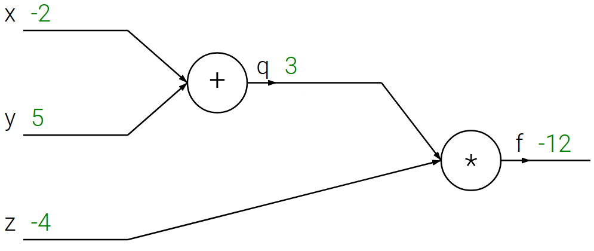
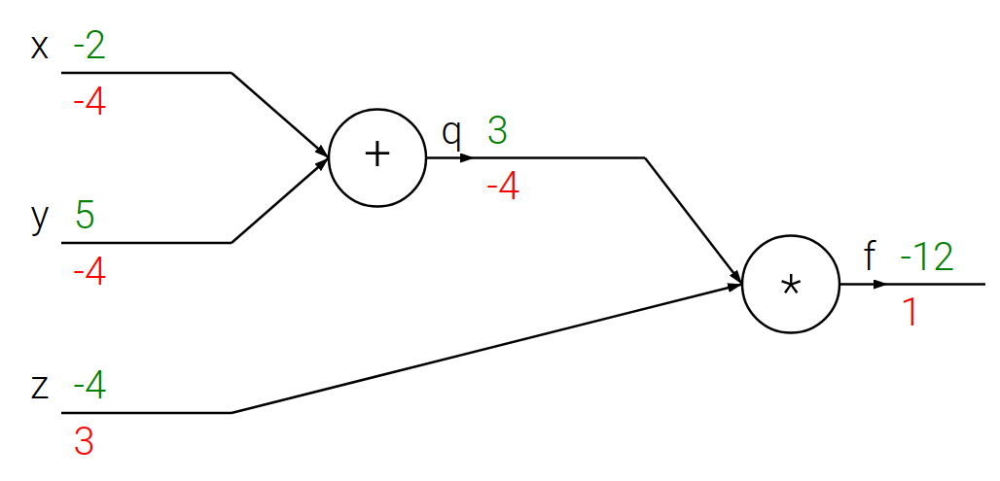
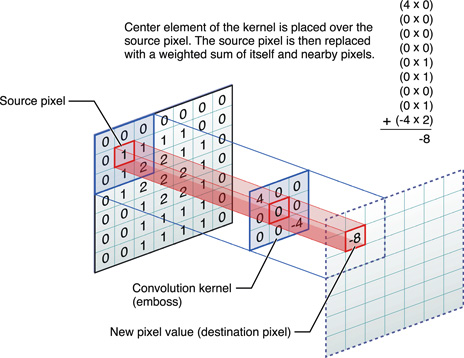
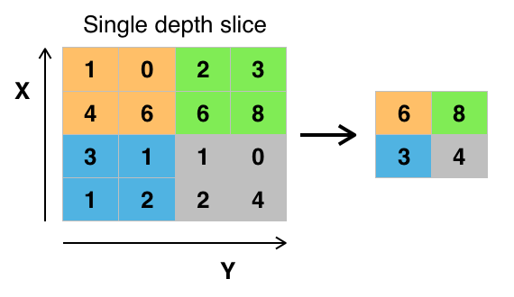
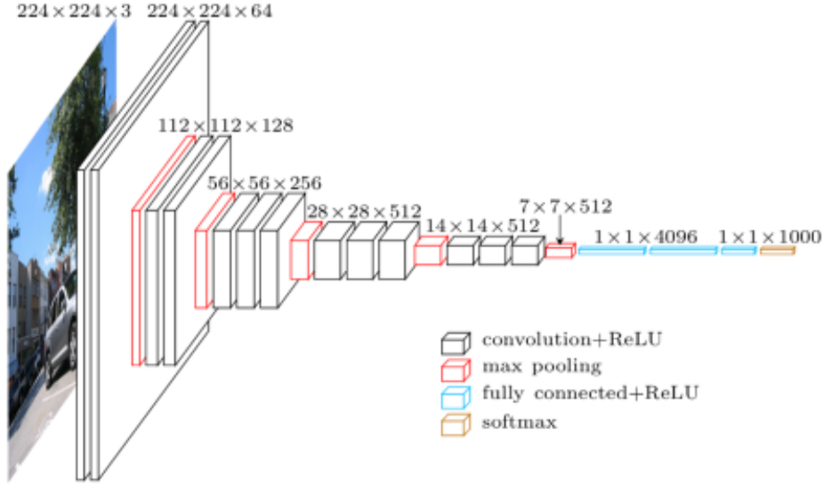

# Lesson 3

## Backpropagation

In this section, we will study the backpropagation algorithm used to
compute the gradients during the training process of neural
networks. The following explanation and pictures are largely based on
the content of [Stanford CS231n
course](http://cs231n.github.io/optimization-2/), for more detailed
explanations please refer to it.

First let's recall the [chain
rule](https://en.wikipedia.org/wiki/Chain_rule) formula used to
compute the derivative of a composite function.


This formula can be written in another form using the [Leibniz's
notation](https://en.wikipedia.org/wiki/Leibniz%27s_notation). In the
following equation, `z` depends on the variable `y` which itself
depends on the variable `x`. `z`, via the intermediate variable of `y`
depends on `x` as well. The chain rule states that:


Intuitively, it tells us that the impact of `x` on the value of `z` is
the product of the impact of `x` on `y` and of `y` on `z`.

The [*backpropagation*](https://en.wikipedia.org/wiki/Backpropagation)
is algorithm used to compute gradients in neural network by applying
the chain rule in a clever way. It is important to note that the
output of the backpropagation is not the *formal expression* of the
gradients but their *values*.

We will run the algorithm on a toy example in order to get an
intuitive understanding of the way it works but it works exactly the
same way on neural networks which are simply huge differentiable
functions.

Let's define the function that we are going to work with.


`f` is a function of three variables `x, y, z` but can also be seen as
a composite function in the second line. We will mostly use this
second version in the following explanation.

Now let's write the [gradient](https://en.wikipedia.org/wiki/Gradient)
of `f`, which is a vector of all the partial derivatives of `f` for
each of its variable `x, y, z`.


The first line of the previous formula is the definition of the
gradient. The second line is obtained using the chain rule. Let's take
the first gradient component `df/dx`, the second line tells us that
the impact of `x` on `f` is the product of the impact of `x` on `q`
and the impact of `q` on `f` as `x` is used in `q` which is itself
used in `f`.

In the example we are going to detail, `x = -2`, `y = 5` and `z = -4`.

The first step of the algorithm is to compute the result of the
function by creating its *computation graph* which is just a fancy
term for a visualization of how we get our result. We compute the
result of the innermost function first.


In this picture the two *leaves* correspond to our input variables `x`
and `y` and contain their respective values `-2` and `5`. Our
*internal node* correspond to `q` and contain its value `3`. We also
remember that the value of the internal node has been obtained by
adding two values.

We then go on to the next computation



Similarly, we create a new internal node that corresponds to the
result of our computation `f`. This node is obtained by multiplying
our intermediate result `q` by a new input variable `z`.

We have computed the value of our function for specific values of its
input variable. To do this, we have made the values of the
computations propagate *forward* (from left to right in our
computation graph representation). This process is called the *forward
pass*, it is what we do when we perform an inference of neural
network.

We are now ready to perform the *backward pass* in which we
*backpropagate* the gradients from the result of the function to its
input variables. We will perform this process from right to left in
our representation.


The derivative of `f` according to `f` is 1, nothing to compute there.

The computation graph tells us that `f` has been obtained by a
product. To compute the gradients for `q` and `z` we have to use
the formula that tells us how to differentiate of a product of two
variables.


By using this formula, we know that the derivative of `f` according to
`q` is the value of `z` and the derivative of `f` according to `z` is
the value of `q`.


Now we want to backpropagate the gradients to `x` and `y`. The
computation graph tells us that `q` has been obtained by an
addition. To compute the derivative of `q` according to `x` and `y`,
we have to use the formula that tells us how to differentiate a sum.


This formula tells us the following:


Now to compute the derivative of `f` according to `x` and `y` we have
to use the chain rule. As we have seen earlier, it tells us the
following:


"Luckily" for us, the value of derivative of `f` according to `q` is
right there in the graph for us to use.



We now have finished our computation and the gradient vector is `[-4,
-4, 3]`.

One thing that is important to notice is that during the computation
of the forward and the backward pass, we have only used very *local*
values stored on the computation graph. It is this point that makes
the backpropagation such an efficient algorithm.

Let's now see how we access this algorithm in PyTorch. First we define
our input variables

```python
>>> x = torch.tensor(-2., requires_grad = True)
>>> y = torch.tensor(5. , requires_grad = True)
>>> z = torch.tensor(-4., requires_grad = True)
>>> x, y, z
(tensor(-2., requires_grad=True), tensor(5., requires_grad=True), tensor(-4., requires_grad=True))
```

While defining each tensor, we precise `requires_grad = True` to
inform PyTorch that we will be computing gradients using this
variables. To allow gradient computation, PyTorch will now create the
*computation graph* while we are using our variables in
computations. This type of behavior is called the *define-by-run*
methodology, we *define* our computation graph as we *run* our
computations. Historically this was an advantage of PyTorch over
TensorFlow which used to use the *define-then-run* methodology in
which you had to generate your whole computation graph before starting
computing your forward pass. Since then a [define-by-run
mode](https://ai.googleblog.com/2017/10/eager-execution-imperative-define-by.html)
has been introduced to TensorFlow.

Now that we have our base variables, let's compute our function `f`.

```python
>>> q = x + y
>>> f = q * z
>>> q, f
(tensor(3., grad_fn=<AddBackward0>), tensor(-12., grad_fn=<MulBackward0>))
```

We see that PyTorch memorized that `q` has been obtained by adding
values and the function that should be used to compute the gradients
is `AddBackward0`. Similarly, `f` has been obtained by multiplying two
values and the function that should be used to compute the gradients
is `MulBackward0`.

Now that we have our result `f`, we can apply the backpropagation
algorithm to compute backpropagate the gradients to all the *leaf*
tensors which have `requires_grad = True`.

```python
>>> f.backward()
>>> x.grad, y.grad, z.grad
(tensor(-4.), tensor(-4.), tensor(3.))
```

As explained in the previous course, the gradient values are stored in
the tensors, right next to their values. This allows the optimizers to
know where to find them.

When defining a neural network all the *parameters* of the layers (its
weights) are defined as tensors with `requires_grad = True`. This is
how PyTorch knows what tensors to compute the gradients of.

```python
>>> import torch.nn as nn
>>> lin = nn.Linear(3, 5)
>>> lin.weight
Parameter containing:
tensor([[-0.0033,  0.5535,  0.1779],
        [ 0.3713, -0.0790,  0.1122],
        [-0.0505,  0.1339, -0.5534],
        [ 0.3604,  0.5361,  0.1966],
        [-0.1884, -0.4768,  0.0522]], requires_grad=True)

>>> lin.bias
Parameter containing:
tensor([-0.0224,  0.2585,  0.4717,  0.1976, -0.4478], requires_grad=True)
```

This is also why with we use the `torch.no_grad` context when we know
we will not use backpropagation. It sets the `requires_grad` of every
tensor to `False`.

Now that we have everything we need to understanding the way neural
networks computes their function and are trained, let's see some other
types of layer.

## Convolution layer

Until now, we have only seen one type of layer, the *linear* or *fully
connected* layer. Although the [universal approximation
theorem](https://en.wikipedia.org/wiki/Universal_approximation_theorem)
tells us that a neural network with a single hidden linear layer
containing a finite number of neurons is able to approximate most
functions that could be interesting to us it has multiple caveats:

- It does not give a bound on the number of neurons necessary
- It does not take into account the generalization potential of the model
- It does take into account the number of training steps required to
  reach the parameter set necessary for the approximation or whether
  it is even
  [possible](https://en.wikipedia.org/wiki/Computational_learning_theory)
  using learning algorithms such as the Gradient Descent.

To remedy these problems, deep learning practitioners use other kind of
layers in order to "help" the neural network be able to learn the
target function.

One of these is the [*Convolution
layer*](https://en.wikipedia.org/wiki/Convolutional_neural_network). Neural
networks that use convolution layers are called Convolutional Neural
Networks (CNNs).

A
[convolution](https://en.wikipedia.org/wiki/Convolution#Discrete_convolution)
is a mathematical operation that consists in taking a *convolution
filter* or *kernel* and applying it to some input. In the following
figure, we have a `3x3` convolution kernel that we apply to a 2D array
of shape `[7, 7]`. The figure only presents the computation of 1 value
of the result.



(image from
[here](https://medium.com/@bdhuma/6-basic-things-to-know-about-convolution-daef5e1bc411))

To compute the whole result, we will make the convolution filter
"slide" across our image. This operation is illustrated in the
following animation.


(This animation is from this
[page](https://github.com/vdumoulin/conv_arithmetic) which is a
brilliant resource to get your head around convolution operations)

At the bottom of the previous animation, you have the input of the
convolution operation. At the top you have the result of the
convolution. This animation shows, for each cell of the output, which
input pixels have been used in the computation.

As you can see, the shape of the output of the process is different
from the shape of the input. We have applied what is called a *strict
convolution* which consists in computing output values only at place
for which the convolution kernel "fits" in the input. In this example,
we loose a 1 pixel band on each side: top, bottom, left and right.

Before digging deeper into convolutions, let's try to get an intuition
of why they are used. Let's apply two different convolutions filters
to the same image and take a look at the output.


These two convolutions are examples of [Sobel
operator](https://en.wikipedia.org/wiki/Sobel_operator), a classical
technique in image processing and computer vision used to *detect
edges*. We notice that each filter generates an output highlighting a
specific piece of information about the input. The top and bottom
outputs, emphasize respectively *horizontal* edges and *vertical*
edges.

Generally, the goal of convolution filters is to extract a specific
piece of information about their input. Historically, the weight and
combination of filters used to detect something specific were created
by researchers. In a way, this process corresponds to [what we
did](appendix/nn_and_solution.md) when we found weights for the neural
network to compute the AND boolean function.

Similarly to fully connected neural networks, we would prefer not to
set the parameters ourselves but find good values using an
optimization algorithm such as the stochastic gradient descent. In the
convolution filter application that we described earlier, we have only
used additions and multiplications which are differentiable
operations. The parameters that we want to optimize are the values
contained in the convolution filters.

The only point slightly different than before is that the same
convolution filter value is used to compute every value of the output
but that does not cause any problem to the backpropagation
algorithm. The function that is computed by the convolution layer
simply uses each of its parameters many times in its formula.

In all the convolution examples that we have seen until now, we only
have considered cases in which the input had only 1 *channel*. Our
data was two dimensional and we had for each cell of this 2D grid a
*single value*. When working with color images, we will typically have
a 3 values by pixel: a red, a green and a blue component. This data
have 3 *channels*. When we apply convolution filters to multi-channel
inputs, each channel will have its own weight matrix and we will
simply *add* the convolution output for each channel. Take a look at
the animation available
[here](http://cs231n.github.io/convolutional-networks/).

In order to consolidate these ideas, let's build a quick PyTorch example.

```python
>>> img_batch = torch.randn(5, 3, 50, 50)
>>> img_batch.shape
torch.Size([5, 3, 50, 50])
```

This tensor represents a batch of data that we want to pass through a
convolution layer. Let's study its shape: we have a batch of `5`
images (or samples), with `3` channels and each image is of shape
`[50, 50]`. This is the standard shape of image batches.

Now let's create our convolution.

```python
>>> convolution = nn.Conv2d(
  in_channels = 3,
  out_channels = 7,
  kernel_size = (3, 3)
)
>>> convolution
Conv2d(3, 7, kernel_size=(3, 3), stride=(1, 1))
```

This convolution layer takes input with `3` channels and is composed
of `7` kernels of shape `(3, 3)`. The `stride` parameter specifies by
how many pixels the kernel is shifted during the sliding operation.

There are a few things to notice with this layer. First, the number of
`in_channels` is `3` which means that for each of the `7` kernels of
the layer we will have `3` `3x3` weight matrices as shown in the
[CS231n
animation](http://cs231n.github.io/convolutional-networks/). Secondly,
we see that we do not specify the *shape* of images that the layer
will take as input, only their number of channels. This is a
specificity of convolutions, the sliding operation does not depends on
the size of the input. Only the shape of the output will depend on it.

```python
>>> convolution_output = convolution(img_batch)
>>> convolution_output.shape
torch.Size([5, 7, 48, 48])
```

Now let's explain the shape of the output. Remember that we started
with an input shape of `[5, 3, 50, 50]`. In the output, we still have
`5` samples. Now each sample is a 3D tensor, as our convolution layer
have 7 `out_channels`, we have computed for (almost) every input pixel
`(R, G, B)` of the input image `7` different values, one for each
kernel of the layer. In the previous sentence, we mentioned that we
have performed computation for "almost" every input pixel because, as
mentioned earlier, we are applying *strict convolutions*. This
implies that we lose a "1 pixel band" around each images, explained
the `[48, 48]` output shape.

In order to fix the *strict convolution* behavior, we often use
*convolution padding*.


When performing convolution operations with padding, we simply perform
our computations "as if" our input were bigger. The non-existent value
are replaced by `0`s.

```python
>>> img_batch = torch.randn(5, 3, 50, 50)
>>> img_batch.shape
torch.Size([5, 3, 50, 50])

>>> convolution = nn.Conv2d(
  in_channels = 3,
  out_channels = 7,
  kernel_size = (3, 3),
  padding = (1, 1)
)
>>> convolution
Conv2d(3, 7, kernel_size=(3, 3), stride=(1, 1), padding=(1, 1))

>>> convolution_output = convolution(img_batch)
>>> convolution_output.shape
torch.Size([5, 7, 50, 50])
```

As we can see in this code, the padding mechanism allows us to keep
the last two dimensions of our input and output tensors identical.

## Pooling layers

The last tool that we need to build convolutional neural networks is a
[*pooling
layer*](https://en.wikipedia.org/wiki/Convolutional_neural_network#Pooling_layer). A
pooling layer is function that we use reduce the quantity of
information (or *down-sample*) that goes through the network.



(image from
[Wikipedia](https://en.wikipedia.org/wiki/Convolutional_neural_network#Pooling_layer))

In the previous figure, we have a `4x4` array on which we apply a
`2x2` *maximum pooling* (max pooling for short) operation. It consists
in diving the original array in 2x2 sections and replacing each
section by its maximum. We effectively loose 75% of the information (3
values for each 2x2 square).

We use pooling layers for multiple reasons:
- It greatly reduces the quantity of computation necessary to apply
  convolutions.
- It improves the
  [translation-invariance](https://arxiv.org/abs/1801.01450) of the
  model. Intuitively, a translation-invariant neural network that
  tries to classify object pictures should output the same prediction
  wherever the object is located is the picture.

Let's write and study a max pooling example in PyTorch.

```python
>>> import torch.nn.functional as F
>>> img_batch = torch.arange(16).float().view(1, 1, 4, 4)
>>> img_batch.requires_grad = True
>>> img_batch
tensor([[[[ 0.,  1.,  2.,  3.],
          [ 4.,  5.,  6.,  7.],
          [ 8.,  9., 10., 11.],
          [12., 13., 14., 15.]]]], requires_grad=True)

>>> max_pooling_output = F.max_pool2d(img_batch, kernel_size = [2, 2])
>>> max_pooling_output
tensor([[[[ 5.,  7.],
          [13., 15.]]]], grad_fn=<MaxPool2DWithIndicesBackward>)

>>> max_pooling_output.shape
torch.Size([1, 1, 2, 2])
```

In this example `img_batch` is a batch of `1` image with `1` channel
and the size of the image is `4x4`.

We apply a max pooling operation using the `max_pool2d` function of
the [functional](https://pytorch.org/docs/stable/nn.functional.html)
interface of PyTorch. This operation is also available as a
`nn.Module` but a good habit to take is mainly use `nn.Module`s for
object with *parameters*, as the max pooling operation does not have
parameter, we use its functional version.

We can also see that the output of the max pooling operation have a
`grad_fn`, which is important as it means it is differentiable.

The output contains `1` sample, with `1` channel and the size of the
image is `2x2` as the pooling operation had a kernel size of `[2, 2]`
just as in earlier figure.

## CNN example

We now have all the tools required to deeply understand the state of
the art model of 2014, [VGG16](https://arxiv.org/abs/1409.1556) (a
model with `16` layers from the Oxford's Visual Geometry Group
(`VGG`)).



(Image from https://www.cs.toronto.edu/~frossard/post/vgg16/)

Let's describe what we can see in this figure. The task that this
model is solving is image classification. It takes `224x224` RGB pixel
images (input shape of `224x224x3`) as input and outputs a probability
distribution of `1000` classes.

This model is composed of two blocks, a *convolutional* one and a fully
connected *one*.

Let's take a look at the convolutional part. This figures illustrates
a very common design choice for convolutional neural networks. The
authors of the paper alternate sequences of convolution layers with
pooling layers. The number of convolution layers along with their
number of filters increases after each max pooling operation. This
increases both the *depth* of hierarchical information captured by
each filter (number of convolution layers) along with the variety of
pattern recognized by the model (number of filter in each layer) while
progressively loosing information of the specific location of each
pattern occurrence.

At the end of the convolutional part of the model, the tensors are
*flattened* (just as we did in the previous practical work) in order
to be given as input to linear layers. The "job" of these linear
layers is to decide what the picture depicts using the "list" of
patterns detected by the convolution layers.
